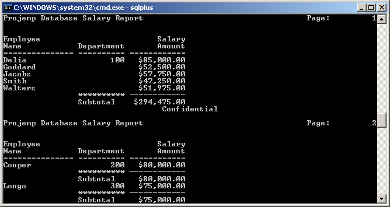

# Intro to Oracle
I took an interesting course called **Introduction to Oracle** that taught some interesting basics about administering and using an Oracle system. Much of what I learned was similar to MySQL, but much was also very different.

 Oracle systems don't really have the concept of seperate databases, for starters. Everything is more focused around the database users, tables, and views. 

 I used Oracle 11g on Windows Server 2003. The first thing I did was create a database using Oracle's Database Configuration Assistant (DBCA). I was able to start and stop the server using DBCA

 After creating the 'projemp' database for my project, I was able to add users, create tables with constraints, query the table, restrict, sort, and join data from tables all using SQL through the SQL*Plus application that comes with Oracle 11g. This sample 'projemp' database is a small database that holds information on a company's employees, projects, salaries, and the status of the company projects. I also created synonyms, views, indexes, and sequences. Sequences and synonyms were new to me so they were definitely pretty intriguing to work with. A sequence is an object with a rule that determines what the 'next' object will be in the sequence. For example a sequence definied to increment 1 will always increment by 1 when the '.nextval' pseudocolumn is called on the sequence name 

In the last lesson we went over formatting a report in Oracle 11g. This is one of the more interesting things I feel I learned during the course. 

I made a formatted report from the database that I created.
The sql to generate the report in the image above can be downloaded[ here](emprpt.sql).  It's a nifty SQL script that generates a report of employee salaries broken up by department. It also generates a sum of salaries in total. The text output of the report is [here](emprpt.LST).

<I backed up the database using the 'exp' export utility [here](intro_oracle.dmp).
